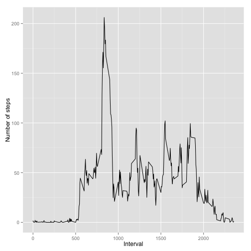

# Reproducible Research: Peer Assessment 1


## Loading and preprocessing the data

Unzip and read data from file in working directory:


```r
dataFile <- unzip("activity.zip")
data <- read.csv(dataFile)
```

Add data processing and graph packages:


```r
library(dplyr)
library(ggplot2)
```

## What is mean total number of steps taken per day?

Evaluate data frame of the total number of steps taken each day:


```r
dataPerDay <- group_by(data, date)
sumData <- summarise(dataPerDay, sumSteps=sum(steps, na.rm=TRUE))
```

Plot a histogram of this data set:


```r
ggplot(sumData) + geom_histogram(aes(x=sumSteps), binwidth=1000) + 
    xlab("Total number of steps per day")
```

 

Calculate mean and median total number of steps taken per day:


```r
mean(sumData$sumSteps)
```

```
## [1] 9354
```

```r
median(sumData$sumSteps)
```

```
## [1] 10395
```

## What is the average daily activity pattern?

Split data set on 5-minute intervals and evaluate avarage number of steps:


```r
dataPerInterval <- group_by(data, interval)
dataMeanInterval <- summarise(dataPerInterval, 
    meanSteps = mean(steps, na.rm=TRUE))
```

Plot it:


```r
ggplot(dataMeanInterval) + geom_line(aes(x=interval, y=meanSteps)) + 
    xlab("Interval") + ylab("Number of steps")
```

 

Find the interval which contains maximum number of steps:


```r
dataMeanInterval[dataMeanInterval$meanSteps == max(dataMeanInterval$meanSteps),]
```

```
## Source: local data frame [1 x 2]
## 
##     interval meanSteps
## 104      835     206.2
```

As we see it's interval from 08:35 to 08:40

## Imputing missing values

Calculate number of missing values:


```r
dataNA <- data[is.na(data),]
nrow(dataNA)
```

```
## [1] 2304
```

Create two vectors where key is interval and value is avarage number of steps
in this interval. Than filling NA values by the mean steps for that 5-minute
interval:


```r
key <- dataMeanInterval$interval
value <- dataMeanInterval$meanSteps
for (i in 1:length(key)) {
    dataNA[dataNA$interval == key[i],]$steps <- value[i]
}
```

Create new data set with the missing data fill in:


```r
dataNew <- data
dataNew[is.na(dataNew),]$steps <- as.integer(round(dataNA$steps))
```

Plot new data set histogram:


```r
dataNewPerDay <- group_by(dataNew, date)
sumDataNew <- summarise(dataNewPerDay, sumSteps=sum(steps, na.rm=TRUE))
ggplot(sumDataNew) + geom_histogram(aes(x=sumSteps), binwidth=1000) + 
    xlab("Total number of steps per day")
```

 

Calculate mean and median of new dataset:


```r
mean(sumDataNew$sumSteps)
```

```
## [1] 10766
```

```r
median(sumDataNew$sumSteps)
```

```
## [1] 10762
```

We see that values differ in new data set than in origin data. 
And mean value now more close to median value.

## Are there differences in activity patterns between weekdays and weekends?

Create data set with weekday/weekend factor:

```r
dataNew$date <- as.Date(dataNew$date)
dataNew <- mutate(dataNew,
    weekendStatus = as.factor( ifelse(weekdays(dataNew$date) %in% 
        c("Saturday", "Sunday"), "weekend", "weekday")))
```

Plot avarage number of steps in interval across all weekdays and
weekend days:


```r
dataWeekPerInterval <-group_by(dataNew, weekendStatus, interval)
dataWeekMeanInterval <- summarise(dataWeekPerInterval, meanSteps = mean(steps))

ggplot(dataWeekMeanInterval) + 
    geom_line(aes(x=interval, y=meanSteps)) + facet_grid(weekendStatus ~ .) + 
    ylab("Number of steps") + xlab("Interval")
```

 
